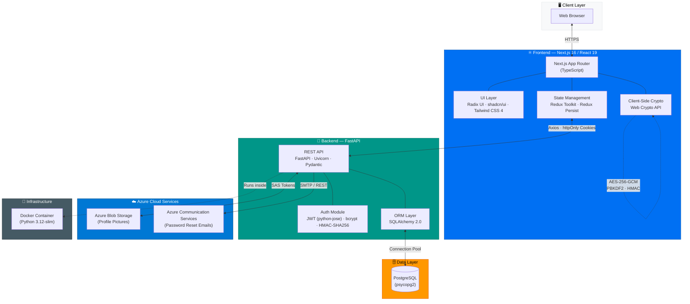

# PassGuard — Architecture Diagrams (Tech Stack)

## High-Level Architecture

---

## Low-Level Architecture

```mermaid
flowchart TB
    subgraph Client["Browser"]
        BrowserApp["Web Browser<br/>JavaScript Runtime"]
    end

    subgraph FE["Frontend — Next.js 16 · React 19 · TypeScript 5"]
        direction TB

        subgraph Pages["App Router — Pages"]
            AuthPages["Auth Pages<br/>/sign-in · /sign-up<br/>/forgot-password · /reset-password"]
            WelcomePage["/welcome<br/>Master Password Setup"]
            PasswordsPage["/passwords<br/>Vault (Locked / Unlocked)"]
            AccountPage["/account/[id]<br/>Profile & Settings"]
        end

        subgraph Components["React Components"]
            AuthForms["Auth Forms<br/>SignInForm · SignUpForm<br/>ForgotPasswordForm · ResetPasswordForm"]
            PasswordComps["Password Components<br/>ListPasswords · PasswordCard<br/>AddPasswordDialog · EditPasswordDialog"]
            AccountComps["Account Components<br/>UpdateUserDialog · DeleteUserDialog<br/>ResetMasterPassword · UploadProfilePic"]
            UIKit["UI Kit (shadcn/ui)<br/>Button · Dialog · Input · Sheet<br/>Sidebar · Sonner · Tooltip<br/><i>Radix UI · Tailwind CSS 4 · CVA</i>"]
        end

        subgraph StateLayer["Redux Toolkit + Redux Persist"]
            UserSlice["userSlice<br/>auth state, profile"]
            PasswordSlice["passwordSlice<br/>encrypted ↔ decrypted passwords"]
            KDFSlice["kdfSlice<br/>vault KDF params, vault key status"]
            AuthAPI["authAPI.ts<br/>login · signup · logout<br/>refresh · challenge · verify<br/>password reset · master password"]
            PasswordAPI["passwordAPI.ts<br/>CRUD encrypted passwords"]
            StorageAPI["storageAPI.ts<br/>SAS token · file upload"]
        end

        subgraph CryptoLayer["Client-Side Crypto (Web Crypto API)"]
            KDF["kdf.ts<br/>PBKDF2-SHA256<br/>deriveAuthKey() → 32-byte HMAC key<br/>deriveVaultKey() → 256-bit AES key<br/>125,000 iterations"]
            AESGCM["aesgcm.ts<br/>AES-256-GCM<br/>encryptString() → {iv, ciphertext}<br/>decryptString() → plaintext<br/>12-byte random IV"]
            HMACMod["hmac.ts<br/>HMAC-SHA256<br/>hmac256Base64Url()<br/>challenge-response signing"]
            KeyStore["keyStore.ts<br/>In-Memory Key Store<br/>setVaultKey() · getVaultKey()<br/>clearVaultKey()<br/>⚠️ Never persisted to disk"]
        end

        subgraph HTTP["HTTP Client"]
            Axios["Axios<br/>withCredentials: true<br/>baseURL: /api/v1<br/>Interceptors"]
        end
    end

    subgraph BE["Backend — FastAPI · Python 3.12 · Uvicorn"]
        direction TB

        subgraph Routes["API Routes (/api/v1)"]
            AuthRoutes["/auth<br/>POST / (register)<br/>POST /login (JWT login)<br/>GET /login/challenge<br/>POST /login/verify<br/>GET /validate_user<br/>POST /logout<br/>GET / · PATCH / · DELETE /<br/>PUT /update_password<br/>GET /refresh_token<br/>POST /password_reset_request<br/>POST /reset_password<br/>GET /me/kdf<br/>POST /master_password"]
            PWRoutes["/passwords<br/>POST / (add)<br/>GET / (list all)<br/>GET /{id}<br/>PUT /{id} (update)<br/>DELETE /{id}"]
            SvcRoutes["/services<br/>POST / (create)<br/>GET / (list)<br/>DELETE /{id}"]
            SASRoutes["/storage<br/>POST /profile-upload (SAS write)<br/>POST /profile-read (SAS read)"]
        end

        subgraph Controllers["Controllers"]
            AuthCtrl["auth.py<br/>register_user() · get_user()<br/>update_user() · delete_user()<br/>update_password()<br/>create_master_password()"]
            LoginCtrl["login.py<br/>login_user() · validate_user()<br/>generate_token() · refresh_access_token()<br/>login_challenge() · login_verify()<br/>challenge_store (in-memory dict)"]
            PWCtrl["password.py<br/>add_password() · get_passwords()<br/>update_password() · delete_password()"]
            SecurityCtrl["security.py<br/>password_reset_request()<br/>reset_password()<br/>SHA256 token hashing"]
            StorageCtrl["storage.py<br/>generate_sas_url()<br/>configure_storage_cors()"]
            EmailCtrl["email.py<br/>send_password_reset_email()<br/>Azure Communication Services SDK"]
            ServiceCtrl["service.py<br/>create_service() · get_services()<br/>delete_service()"]
        end

        subgraph Auth["Auth & Security"]
            JWTMod["JWT Module (python-jose)<br/>HS256 · 15-min access · 7-day refresh<br/>httpOnly secure cookies<br/>Issuer & Audience validation"]
            BCryptMod["BCrypt (passlib · bcrypt)<br/>Account password hashing"]
            HMACAuth["HMAC-SHA256 (hmac · hashlib)<br/>Challenge-response verification<br/>Constant-time comparison"]
            OAuth2["OAuth2PasswordBearer<br/>Cookie-first, header fallback"]
        end

        subgraph Schemas["Pydantic Schemas"]
            SchemasMod["schema.py<br/>UserCreate · UserResponse · UserLogin<br/>TokenResponse · LoginVerifyRequest<br/>PasswordItemIn · PasswordItemOut<br/>MasterPasswordRequest<br/>ProfileUploadSASRequest"]
        end

        subgraph ORMLayer["SQLAlchemy 2.0 ORM"]
            Models["model.py<br/>User · AuthToken<br/>Services · Passwords<br/>PasswordResetToken"]
            Engine["Engine<br/>pool_size=10 · max_overflow=20<br/>pool_pre_ping=True<br/>pool_recycle=3600s"]
            SessionMgr["SessionLocal<br/>sessionmaker<br/>Dependency injection via get_db()"]
        end
    end

    subgraph DB["PostgreSQL Database"]
        UserTbl[("User<br/>id · username · email<br/>hashed_password · role<br/>auth_* KDF params<br/>vault_* KDF params")]
        AuthTokenTbl[("AuthToken<br/>id · user_id (FK)<br/>token · expires_at")]
        ServicesTbl[("Services<br/>id · name · image_url")]
        PasswordsTbl[("Passwords<br/>id · user_id (FK)<br/>service_name (FK)<br/>ciphertext_b64u · iv_b64u")]
        ResetTbl[("PasswordResetToken<br/>id · user_id (FK)<br/>token (SHA256) · expires_at · used")]
    end

    subgraph Azure["Azure Cloud Services"]
        BlobStorage["Azure Blob Storage<br/>azure-storage-blob SDK<br/>SAS token auth (5-min expiry)<br/>Container: profile pictures"]
        ACS["Azure Communication Services<br/>azure-communication-email SDK<br/>Password reset emails<br/>HTML email templates"]
    end

    subgraph Infra["Infrastructure"]
        DockerImg["Docker<br/>python:3.12-slim<br/>uv package manager<br/>Uvicorn ASGI server<br/>Port 8000"]
    end

    %% ── Connections ──

    BrowserApp <-->|"HTTPS"| Pages

    AuthPages --- AuthForms
    WelcomePage --- AccountComps
    PasswordsPage --- PasswordComps
    AccountPage --- AccountComps

    AuthForms --> UIKit
    PasswordComps --> UIKit
    AccountComps --> UIKit

    AuthForms --> UserSlice
    PasswordComps --> PasswordSlice
    PasswordComps --> KDFSlice
    AccountComps --> UserSlice

    UserSlice --> AuthAPI
    PasswordSlice --> PasswordAPI
    KDFSlice --> AuthAPI
    AccountComps --> StorageAPI

    PasswordSlice --> AESGCM
    KDFSlice --> KDF
    KDFSlice --> HMACMod
    KDFSlice --> KeyStore
    AESGCM --> KeyStore

    AuthAPI --> Axios
    PasswordAPI --> Axios
    StorageAPI --> Axios

    Axios <-->|"REST / JSON<br/>httpOnly Cookies"| Routes

    AuthRoutes --> AuthCtrl
    AuthRoutes --> LoginCtrl
    AuthRoutes --> SecurityCtrl
    PWRoutes --> PWCtrl
    SvcRoutes --> ServiceCtrl
    SASRoutes --> StorageCtrl

    LoginCtrl --> JWTMod
    LoginCtrl --> HMACAuth
    LoginCtrl --> BCryptMod
    LoginCtrl --> OAuth2
    AuthCtrl --> BCryptMod
    SecurityCtrl --> EmailCtrl

    AuthCtrl --> SchemasMod
    LoginCtrl --> SchemasMod
    PWCtrl --> SchemasMod

    AuthCtrl --> Models
    LoginCtrl --> Models
    PWCtrl --> Models
    SecurityCtrl --> Models
    ServiceCtrl --> Models

    Models --> SessionMgr
    SessionMgr --> Engine
    Engine <-->|"psycopg2<br/>Connection Pool"| DB

    UserTbl --- AuthTokenTbl
    UserTbl --- PasswordsTbl
    UserTbl --- ResetTbl
    ServicesTbl --- PasswordsTbl

    StorageCtrl <-->|"SAS URL Generation"| BlobStorage
    StorageAPI <-->|"Direct PUT<br/>(browser → blob)"| BlobStorage
    EmailCtrl -->|"Send Email"| ACS

    BE -.->|"Containerized"| DockerImg

    %% ── Styling ──
    style Client fill:#f8f9fa,stroke:#adb5bd,color:#000
    style FE fill:#0070f3,stroke:#0051a8,color:#fff
    style BE fill:#009688,stroke:#00695c,color:#fff
    style DB fill:#ff9800,stroke:#e65100,color:#000
    style Azure fill:#0078d4,stroke:#004578,color:#fff
    style Infra fill:#455a64,stroke:#263238,color:#fff

    style Pages fill:#1a8cff,stroke:#0051a8,color:#fff
    style Components fill:#1a8cff,stroke:#0051a8,color:#fff
    style StateLayer fill:#0060df,stroke:#003d8f,color:#fff
    style CryptoLayer fill:#d32f2f,stroke:#9a0000,color:#fff
    style HTTP fill:#0060df,stroke:#003d8f,color:#fff

    style Routes fill:#00796b,stroke:#004d40,color:#fff
    style Controllers fill:#00796b,stroke:#004d40,color:#fff
    style Auth fill:#e53935,stroke:#ab000d,color:#fff
    style Schemas fill:#00796b,stroke:#004d40,color:#fff
    style ORMLayer fill:#f57c00,stroke:#bb4d00,color:#fff
```

---

## Tech Stack Summary

### Frontend

| Layer | Technology | Version | Purpose |
| ------- | ----------- | --------- | --------- |
| Framework | Next.js (App Router) | 16.1.6 | SSR, routing, React framework |
| UI Library | React | 19.2.3 | Component rendering |
| Language | TypeScript | 5.x | Type safety |
| Styling | Tailwind CSS | 4.x | Utility-first CSS |
| Component Kit | shadcn/ui + Radix UI | latest | Accessible UI primitives |
| State | Redux Toolkit + Redux Persist | 2.11 / 6.0 | Global state & persistence |
| Forms | React Hook Form + Zod | 7.71 / 4.3 | Validation & form handling |
| HTTP | Axios | 1.13 | API requests with credentials |
| Crypto | Web Crypto API | native | AES-GCM, PBKDF2, HMAC |
| Theming | next-themes | 0.4 | Dark/light mode |
| Toasts | Sonner | 2.0 | Toast notifications |
| Icons | Lucide React | 0.575 | SVG icon set |

### Backend

| Layer | Technology | Version | Purpose |
| ------- | ----------- | --------- | --------- |
| Framework | FastAPI | 0.133+ | Async REST API |
| Server | Uvicorn | 0.41+ | ASGI server |
| Language | Python | 3.12 | Runtime |
| ORM | SQLAlchemy | 2.0+ | Database ORM & connection pooling |
| Schemas | Pydantic | 2.12+ | Request/response validation |
| Auth (JWT) | python-jose | 3.5 | JWT encode/decode (HS256) |
| Auth (Password) | bcrypt + passlib | 5.0 / 1.7 | Password hashing |
| Auth (HMAC) | hmac + hashlib | stdlib | Challenge-response verification |

### Data & Cloud

| Layer | Technology | Purpose |
| ------- | ----------- | --------- |
| Database | PostgreSQL (psycopg2) | Primary data store |
| Blob Storage | Azure Blob Storage | Profile picture storage (SAS auth) |
| Email | Azure Communication Services | Password reset emails |
| Container | Docker (python:3.12-slim) | Deployment containerization |
| Package Manager | uv | Fast Python dependency management |

### Security Architecture

| Concern | Implementation |
| --------- | --------------- |
| Account passwords | bcrypt hash (server-side) |
| Vault encryption | AES-256-GCM (client-side only) |
| Key derivation | PBKDF2-SHA256 · 125,000 iterations |
| Master password verification | HMAC-SHA256 challenge-response |
| Session tokens | JWT (HS256) · httpOnly secure cookies |
| Token refresh | 15-min access / 7-day refresh rotation |
| Password reset tokens | SHA256-hashed · 1-hour expiry · single-use |
| File upload auth | Azure SAS tokens · 5-min expiry |
| Zero-knowledge design | Vault key never leaves client memory |
