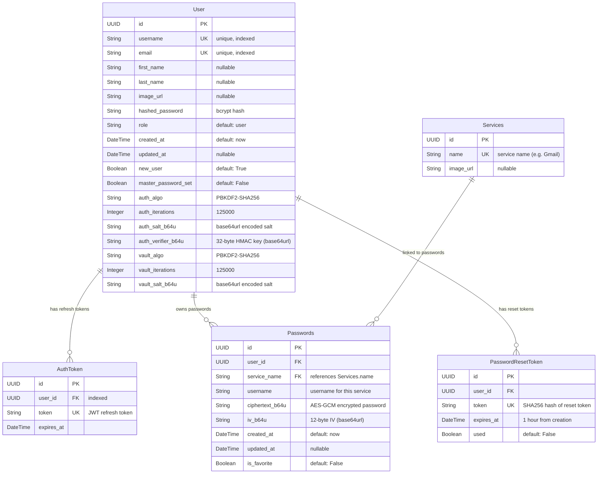

# PassGuard — Database ER Diagram

## Entity-Relationship Diagram

## Table Details

### User

The central entity. Stores account credentials (bcrypt-hashed password), profile info, and **two sets of KDF parameters**:

- **Auth KDF** (`auth_*`): Used for challenge-response authentication of the master password. The `auth_verifier_b64u` is a 32-byte HMAC key derived from the master password, stored server-side to verify identity without ever storing the master password itself.
- **Vault KDF** (`vault_*`): Parameters sent to the client so it can re-derive the AES-256-GCM vault key from the master password. The vault key is **never stored** on the server.

### AuthToken

Stores JWT refresh tokens. One user can have one active refresh token at a time (old tokens are deleted on each login). Used by `GET /auth/refresh_token` to issue new access tokens.

### Services

A catalog of service names (Gmail, GitHub, etc.) with optional icons. Created automatically when a user stores a password for a new service.

### Passwords

Stores **client-side encrypted** passwords. The `ciphertext_b64u` contains the AES-256-GCM encrypted password and the `iv_b64u` is the 12-byte initialization vector. Decryption happens exclusively on the client using the vault key derived from the master password.

### PasswordResetToken

Tracks account password reset requests. The `token` field stores a **SHA256 hash** of the actual reset token (the plaintext is sent via email). Tokens expire after 1 hour and are marked `used=True` after consumption.

## Relationships

| Relationship              | Type        | Cascade               |
| ------------------------- | ----------- | --------------------- |
| User → AuthToken          | One-to-Many | CASCADE DELETE        |
| User → Passwords          | One-to-Many | CASCADE DELETE        |
| User → PasswordResetToken | One-to-Many | CASCADE DELETE        |
| Services → Passwords      | One-to-Many | via `service_name` FK |
