# PassGuard — Sequence Diagrams

## 1. User Registration (Sign Up)

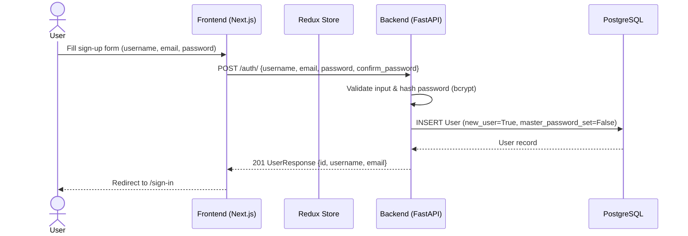

## 2. User Login (Account Password)

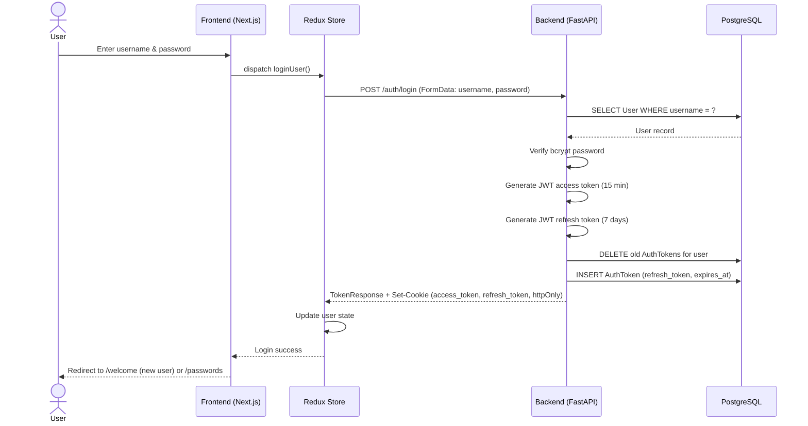

## 3. Create Master Password (First-Time Vault Setup)

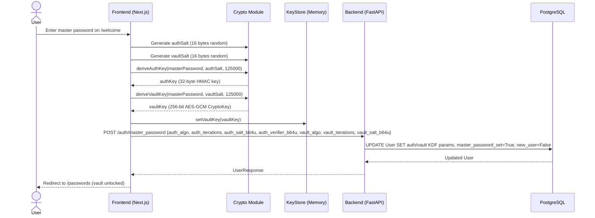

## 4. Unlock Vault (Challenge-Response Authentication)

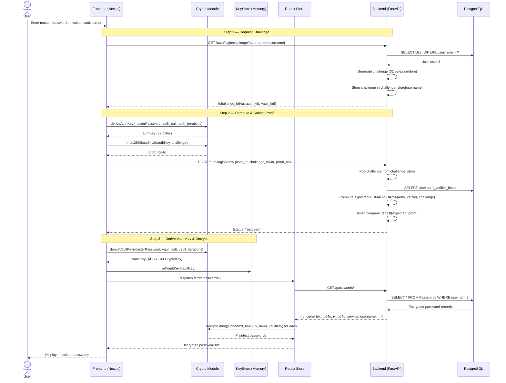

## 5. Add Password

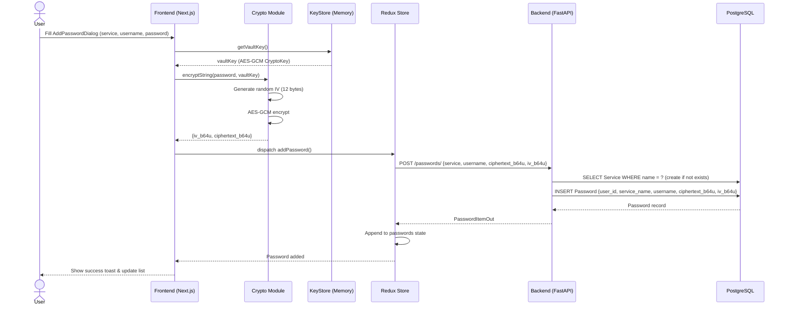

## 6. Edit Password

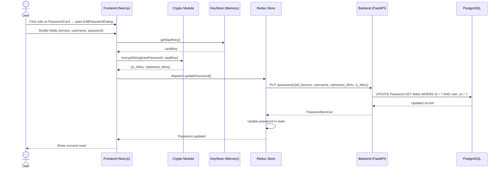

## 7. Delete Password

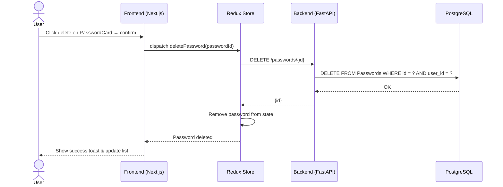

## 8. Token Refresh

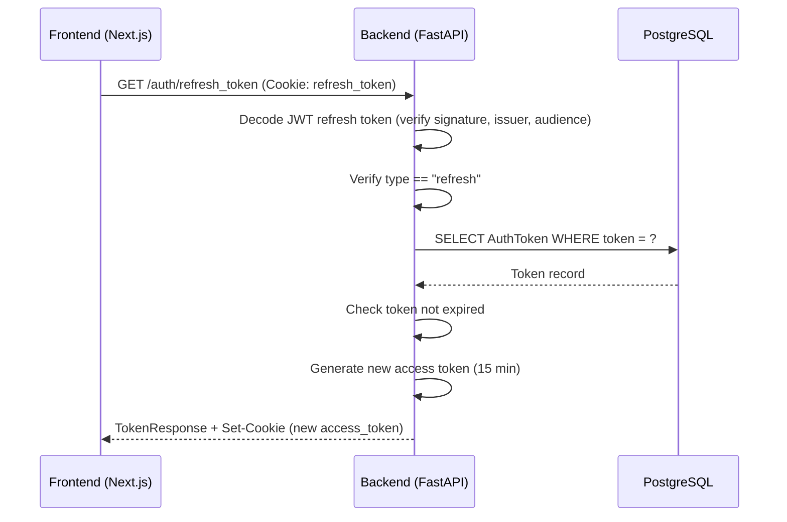

## 9. Password Reset (Forgot Password)

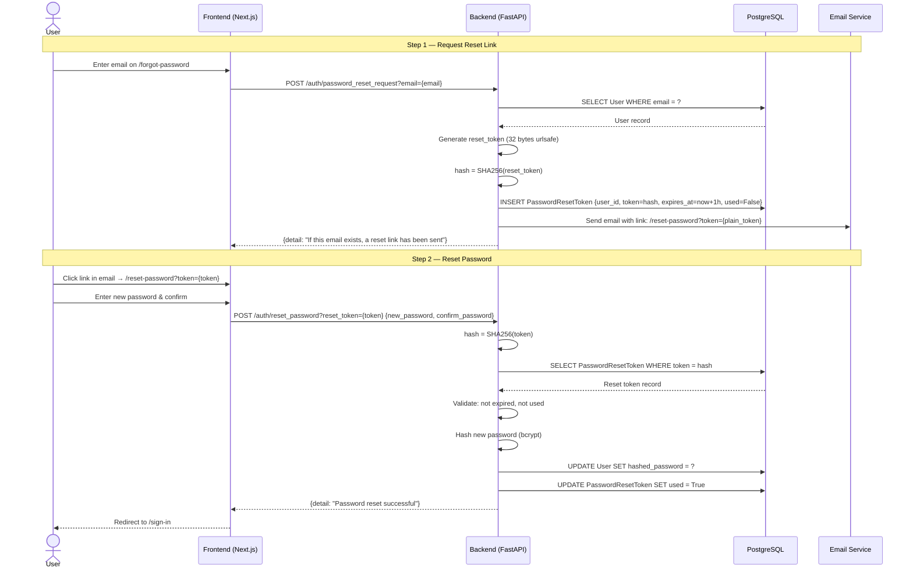

## 10. Reset Master Password (Re-encrypt All Passwords)

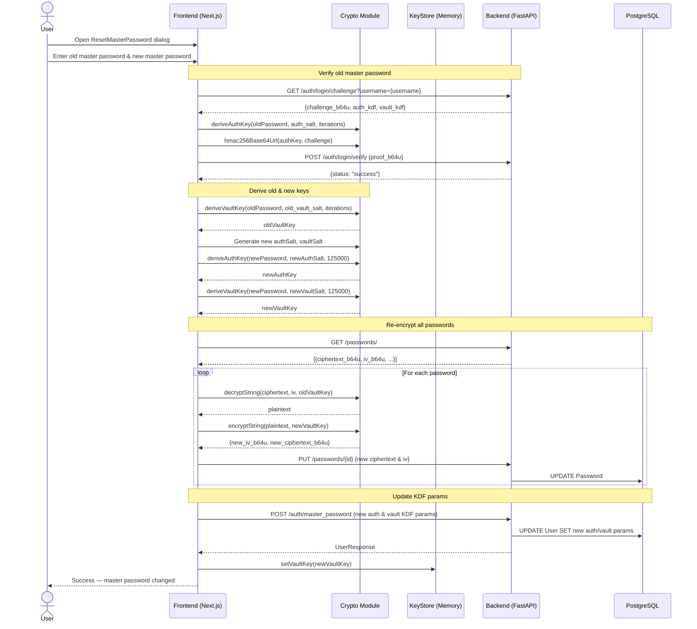

## 11. Upload Profile Picture (Azure Blob Storage)

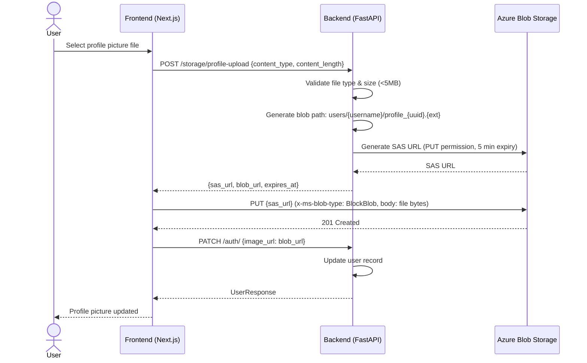

## 12. Lock Vault

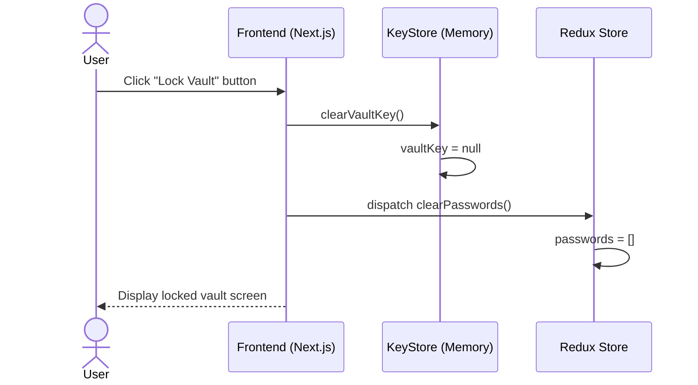

## 13. Logout

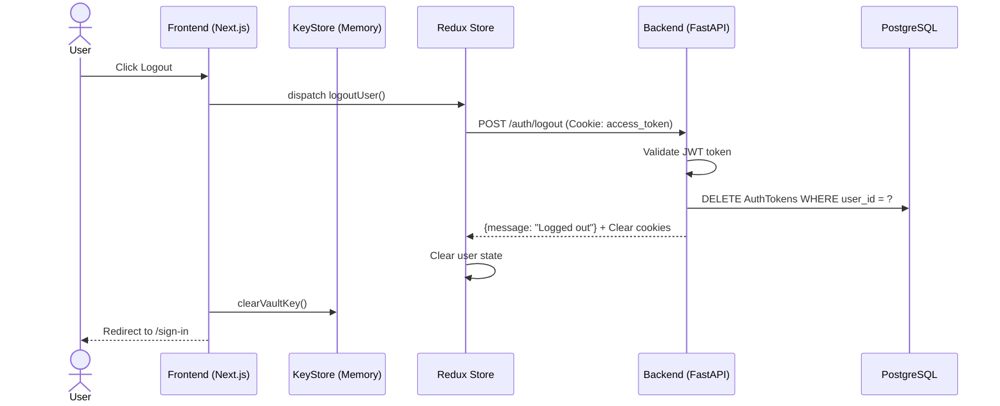
