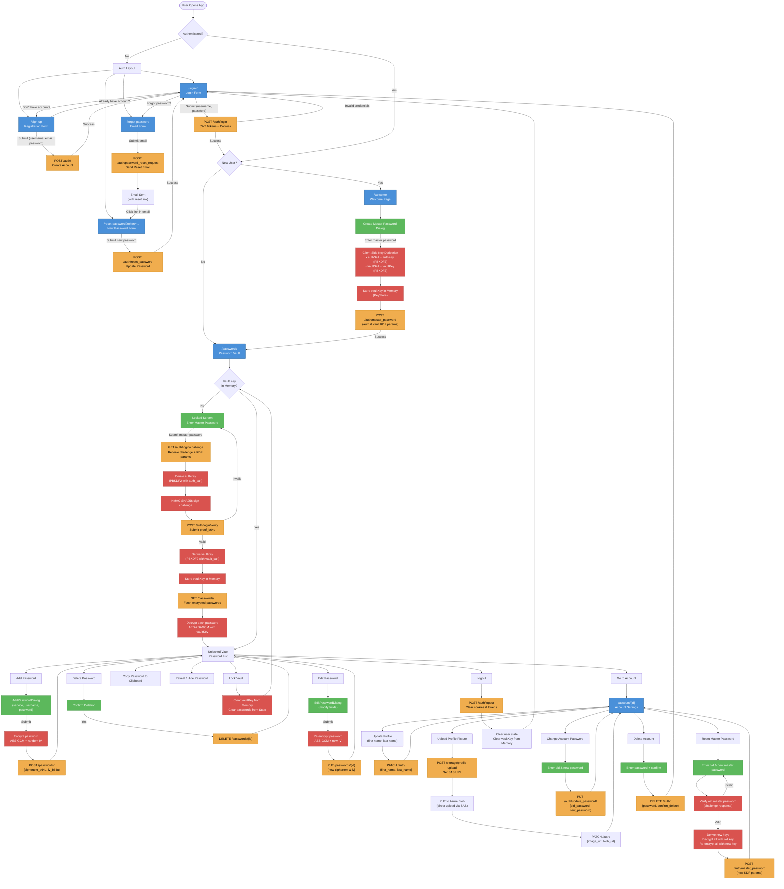

# PassGuard — User Flow Diagram

## Complete Application User Flow

## Legend

| Color     | Meaning                  |
| --------- | ------------------------ |
| 🔵 Blue   | Pages / Views            |
| 🟢 Green  | User Actions / Dialogs   |
| 🟡 Yellow | API Calls                |
| 🔴 Red    | Cryptographic Operations |
| ⬜ White  | Decision Points          |
